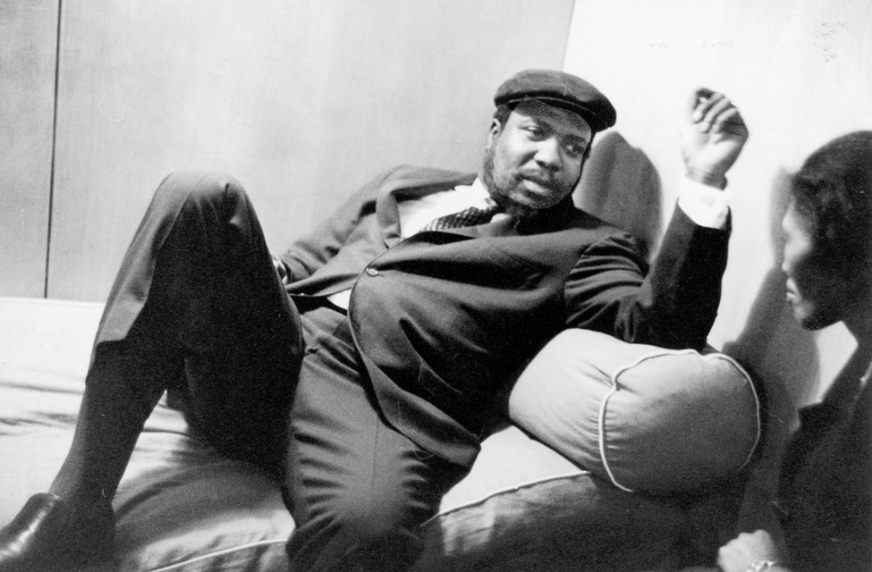

*'Talking about music is like dancing about architecture'*
-__Thelonious Monk__-

Lately I've been thinking about the nature of music and what it means? No I'm not getting into any deep philosophy here. But the more I hear people talking about music it seems that it's losing it's meaning. 
Lot's of analysis and what did one meant with this or what happened to this musician and he/she doesn't produce good music any more. 

So what the deal?